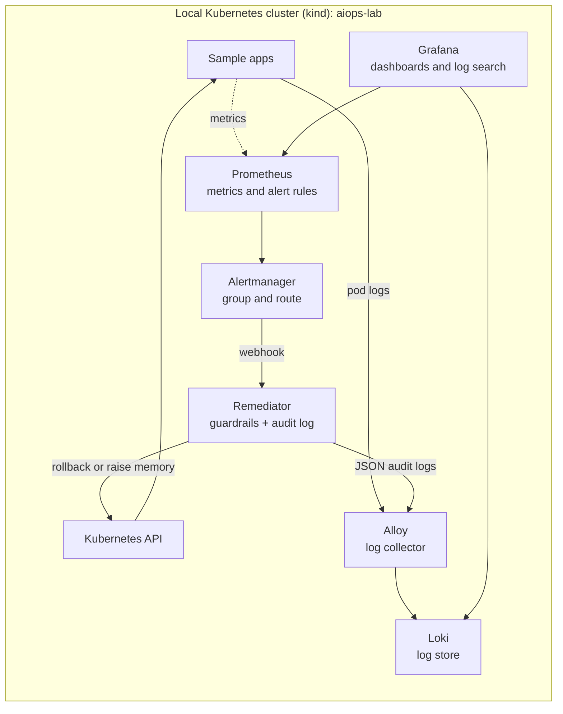

# AIOps Lab

A hands-on, free and open-source lab that builds a small **self-healing Kubernetes platform** on a laptop: deploy an app, break it on purpose, observe it, alert on it, define infrastructure as code, centralize logs, and finally let an alert **trigger an automatic, guard-railed fix**.

The lab is built in seven phases (0 to 6). Every phase has its own folder with the exact files used, and each section below explains what was built, why, and how to repeat it.

> This is a learning project. The settings are sized for a single-node laptop cluster, and the "Known limitations" section lists what a production version would change.

---

## What this lab demonstrates

| Area | Skills shown |
| --- | --- |
| Kubernetes operations | Deployments, Services, rolling updates, self-healing, resource requests and limits, triage of `ImagePullBackOff`, `CrashLoopBackOff` and `OOMKilled` |
| Observability | Metrics and dashboards with Prometheus and Grafana, alert rules in PromQL, alert routing with Alertmanager, centralized logs with Loki and Grafana Alloy, LogQL |
| Infrastructure as Code | OpenTofu with the Kubernetes provider, plan and apply workflow, rebuild from code, drift detection |
| Automation (AIOps) | An alert-driven remediation service with rollback and memory-limit fixes, dry-run mode, opt-in, cooldown, least-privilege RBAC and an audit log |
| Engineering habits | Reading errors first, verifying every step, keeping secrets out of Git, documenting commands and results |

---

## Architecture



In plain words: Prometheus notices a problem, Alertmanager decides who to tell, the remediator fixes only what it is allowed to fix, and every step is searchable in Loki.

---

## Tech stack

| Component | Used for | Version seen in this lab |
| --- | --- | --- |
| WSL2 (Ubuntu) and Docker Desktop | Linux environment and containers | n/a |
| kind | A local Kubernetes cluster inside Docker | v0.33.0 (node image Kubernetes v1.37.0) |
| kubectl, Helm | Cluster CLI and package manager | kubectl v1.37.1, Helm v3.22.0 |
| kube-prometheus-stack | Prometheus, Alertmanager, Grafana, exporters | chart 92.1.1 |
| Grafana Loki (community chart) | Log storage, monolithic mode | chart from `grafana-community` |
| Grafana Alloy | Log collector | chart from `grafana` |
| OpenTofu | Infrastructure as Code | v1.13.1 |
| Python (standard library only) | The remediator service | 3.12 image |

Requirements: a machine with about 16 GB of RAM, Windows 11 with WSL2 or Linux/macOS with Docker, and about 20 GB of free disk. All commands below run in a Linux shell, with the repository cloned into the Linux home folder.

---

## Repository layout

```
aiops-lab/
├── phase0-notes.md          Phase 0 summary
├── phase1/                  app.yaml, crash.yaml, oom.yaml
├── phase3/                  rules.yaml, triggers.yaml
├── phase4/                  main.tf, .terraform.lock.hcl, .gitignore
├── phase5/                  loki-values.yaml, alloy-values.yaml, logdemo.yaml
└── phase6/                  remediator.yaml, alertmanager-values.yaml, oomapp.yaml
```

Phase 2 reuses `phase1/app.yaml` (resource requests and limits were added to it).

---

## Phase 0: Setup

**Goal:** a working local Kubernetes cluster and the tools to manage it.
**In plain words:** build the runway before anything can take off.

| Step | Why | Command or action |
| --- | --- | --- |
| 1. WSL2 with Ubuntu | A Linux environment, because production servers run Linux | `wsl --install -d Ubuntu` (PowerShell as Administrator), then restart |
| 2. Docker Desktop | Containers, the base for Kubernetes and for services | Install, enable the WSL 2 engine and Ubuntu integration, then `docker run hello-world` |
| 3. kubectl | The remote control for the cluster | See the install snippet below |
| 4. kind | A real Kubernetes cluster inside Docker, with no cloud bill | See the install snippet below |
| 5. Helm | A package manager for Kubernetes | `curl https://raw.githubusercontent.com/helm/helm/main/scripts/get-helm-3 \| bash` |
| 6. OpenTofu | Open-source Infrastructure as Code | Install script from `get.opentofu.org` |
| 7. Cluster | The lab cluster | `kind create cluster --name aiops-lab` |

```bash
# kubectl
curl -LO "https://dl.k8s.io/release/$(curl -L -s https://dl.k8s.io/release/stable.txt)/bin/linux/amd64/kubectl"
sudo install -m 0755 kubectl /usr/local/bin/kubectl && rm kubectl

# kind (latest release; very old versions do not match a recent kubectl)
KIND_VER=$(curl -s https://api.github.com/repos/kubernetes-sigs/kind/releases/latest | grep tag_name | cut -d '"' -f4)
curl -Lo kind https://kind.sigs.k8s.io/dl/$KIND_VER/kind-linux-amd64
chmod +x kind && sudo mv kind /usr/local/bin/kind
```

**Verify:** `kubectl get nodes` shows the node `Ready` (it may show `NotReady` for under a minute right after creation), and `kubectl get pods -A` shows the system pods `Running`.

**What the system pods do:** `kube-apiserver` is the front door for every request, `etcd` stores the cluster state, `kube-scheduler` chooses where pods run, `kube-controller-manager` keeps the desired state (self-healing), `kube-proxy` routes traffic, `coredns` resolves service names, and the CNI plugin provides pod networking.

**Why kind:** it runs real Kubernetes, so `kubectl`, YAML and Helm skills transfer directly to managed services such as AKS or EKS. It does not cover cloud-only parts such as load balancers, managed identity or node autoscaling.

---

## Phase 1: Kubernetes basics

**Goal:** deploy an app, watch it self-heal, then break it three ways and fix each with one repeatable triage routine.
**In plain words:** learn to be the doctor on call.

1. **Deploy** an nginx Deployment with 2 replicas and a Service:
   ```bash
   kubectl apply -f phase1/app.yaml
   kubectl get deployments,pods,svc
   kubectl port-forward svc/web 8080:80      # then open http://localhost:8080
   ```
2. **Self-healing:** delete one pod (`kubectl delete pod <name>`) and watch a replacement appear immediately, because the Deployment must keep 2 replicas.
3. **Break and fix:**

   | Failure | How it was caused | Where to look first | Fix |
   | --- | --- | --- | --- |
   | `ImagePullBackOff` | `kubectl set image deployment/web nginx=nginx:does-not-exist` | `kubectl describe pod` (Events) | `kubectl rollout undo deployment/web` |
   | `CrashLoopBackOff` | A pod whose command prints an error to stderr, then sleeps for an hour (`crash.yaml`) — the error is visible in the logs of a `Running` pod rather than causing an actual restart loop | `kubectl logs` | Correct the command |
   | `OOMKilled` (exit code 137) | A 100 MB workload with a 200Mi memory limit (`oom.yaml`) | `kubectl describe pod`, Last State | Raise the limit |

**Key learnings**
- During a bad rolling update the old pods keep serving, because `maxUnavailable` rounds down to 0 for 2 replicas, so there is no downtime.
- The container never starts with `ImagePullBackOff`; a real `CrashLoopBackOff` needs the app to actually exit (non-zero) repeatedly, not just log an error while staying `Running`; with `OOMKilled` the kernel kills it for exceeding its memory limit.
- `kubectl logs --previous` can fail once the old container is cleaned up, which motivates Phase 5.

---

## Phase 2: Monitoring with Prometheus and Grafana

**Goal:** see the cluster's CPU and memory, per pod, in dashboards.
**In plain words:** install a health scanner (Prometheus) and a screen (Grafana).

```bash
helm repo add prometheus-community https://prometheus-community.github.io/helm-charts
helm repo update
helm install monitoring prometheus-community/kube-prometheus-stack -n monitoring --create-namespace
kubectl get pods -n monitoring -w          # first start takes several minutes: large images
```

Open Grafana through a tunnel. The admin password is read from a Kubernetes Secret at runtime and is never stored in the repository:

```bash
kubectl get secret -n monitoring monitoring-grafana -o jsonpath="{.data.admin-password}" | base64 -d; echo
kubectl port-forward -n monitoring svc/monitoring-grafana 3000:80     # http://localhost:3000, user: admin
```

1. Open the dashboard `Kubernetes / Compute Resources / Namespace (Pods)` for namespace `default`.
2. Utilisation panels first showed "No data": the pods had no resource `requests` and `limits`, and were idle.
3. Add `resources` to the container in `phase1/app.yaml` (requests 50m CPU and 64Mi memory, limits 200m CPU and 128Mi memory), apply it, then send some traffic. The panels then show percentages.
4. In **Explore**, try PromQL such as `kube_pod_container_status_restarts_total{namespace="default"}`.

**Key learnings**
- Utilisation percentages need `requests` and `limits`; every production pod should define them.
- `kubectl port-forward` pins to a single pod and is a debugging tool, not a load-balancing test.
- Restart counters only ever increase, so alerts use `increase()` over a time window.

---

## Phase 3: Alerting

**Goal:** turn the three Phase 1 failures into alerts that fire on their own.
**In plain words:** tell the scanner exactly when to raise its voice.

1. `phase3/rules.yaml` defines a `PrometheusRule` with three alerts: `PodCrashLooping` (more than 2 restarts in 5 minutes), `PodImagePullFailing` and `PodOOMKilled`. Each uses `for: 1m` where appropriate, so short spikes do not page anyone. The label `release: monitoring` must match the Helm release name or Prometheus ignores the rule.
   ```bash
   kubectl apply -f phase3/rules.yaml
   kubectl get prometheusrule -n monitoring
   ```
2. Confirm the rules loaded: tunnel to Prometheus (`kubectl port-forward -n monitoring svc/monitoring-kube-prometheus-prometheus 9090:9090`) and open `/alerts`; all three show **Inactive**.
3. Trigger them with `phase3/triggers.yaml` (three deliberately failing pods) and watch each alert move **Inactive → Pending → Firing**.
4. Open Alertmanager (`kubectl port-forward -n monitoring svc/monitoring-kube-prometheus-alertmanager 9094:9093`) to see the grouped alerts.

**Key learnings**
- An alert has three states: Inactive (condition false), Pending (true but not yet for the `for` duration) and Firing.
- One root cause can raise two alerts: an OOM-killed pod is restarted, so it also looks like a crash loop.
- By default Alertmanager routes to a `null` receiver; Phase 6 adds a real one.

---

## Phase 4: Infrastructure as Code with OpenTofu

**Goal:** describe part of the environment as code, rebuild it from that code, and detect manual changes.
**In plain words:** write the recipe instead of cooking by hand.

| Term | Meaning |
| --- | --- |
| Provider | The plugin that translates code into Kubernetes API calls |
| State file | OpenTofu's record of what it created (git-ignored, because it can hold cluster details) |
| `tofu plan` | A preview of the changes, with no side effects |
| `tofu apply` | Makes the real changes |
| Drift | A difference between the code and the real cluster |

1. `phase4/main.tf` declares a namespace `tofu-lab` and a `web-tofu` Deployment (2 replicas, with requests and limits) and Service. The Deployment refers to the namespace resource instead of repeating its name, so OpenTofu learns the creation order.
2. Run:
   ```bash
   cd phase4
   tofu init
   tofu plan
   tofu apply
   ```
3. **Rebuild test:** `tofu destroy`, then `tofu apply -auto-approve` recreates everything from code.
4. **Drift test:** `kubectl scale deployment web-tofu -n tofu-lab --replicas=5`, then `tofu plan` reports `replicas "5" -> "2"`, and `tofu apply -auto-approve` restores it.

**Git hygiene:** commit `main.tf`, `.terraform.lock.hcl` and `.gitignore`. Never commit `terraform.tfstate` or `.terraform/`.

Phase 4 manages only the `tofu-lab` namespace and its two objects; the rest of the lab was created with `kubectl` and Helm.

---

## Phase 5: Centralized logs with Loki and Alloy

**Goal:** keep pod logs after the pod is gone.
**In plain words:** copy every pod's diary into one searchable library.

Path of a log line: pod output → Alloy (collector) → Loki (store) → Grafana (search with LogQL).

1. **Install Loki** (the chart now lives in the Grafana community repository). The values file runs it as a single process with filesystem storage and switches off components that do not fit a one-node cluster (the memcached caches, the canary and the Helm test):
   ```bash
   helm repo add grafana-community https://grafana-community.github.io/helm-charts
   helm repo add grafana https://grafana.github.io/helm-charts
   helm repo update
   helm install loki grafana-community/loki -n loki --create-namespace -f phase5/loki-values.yaml
   ```
2. **Install Alloy**, configured in `phase5/alloy-values.yaml` to discover pods, label their logs (`namespace`, `pod`, `container`, `cluster`) and push them to the Loki gateway:
   ```bash
   helm install alloy grafana/alloy -n monitoring -f phase5/alloy-values.yaml
   ```
3. **Connect Grafana:** add a Loki data source with the URL `http://loki-gateway.loki.svc.cluster.local`.
4. **Demo:** run `phase5/logdemo.yaml` (a pod that logs an error and exits), query `{namespace="default", pod="logdemo"}` in Grafana Explore, then `kubectl delete pod logdemo`. The pod is gone, but its log lines remain searchable.

Useful LogQL: `{namespace="default"} |= "ERROR"` filters lines, and `sum by (pod) (count_over_time({namespace="default"} |= "ERROR" [1m]))` counts errors per pod.

**Key learnings**
- Loki indexes only labels, not the log text, so select streams by label first and filter text second.
- Check a chart's current repository and defaults before installing: this chart had moved repositories and its default caches would not fit a small cluster.

---

## Phase 6: Auto-remediation with guardrails

**Goal:** a firing alert triggers an automatic fix, safely.
**In plain words:** a duty robot with a limited ID card and a strict rulebook.

Flow: Prometheus alert → Alertmanager webhook → remediator service → Kubernetes API change → JSON audit log in Loki.

| Alert | Automatic action | Limit |
| --- | --- | --- |
| `PodImagePullFailing` | Roll the Deployment back to its previous revision | Current revision only |
| `PodOOMKilled` | Double the container's memory limit | Capped at 512Mi |
| `PodCrashLooping` | None; logs that a human is needed | n/a |

**Guardrails**

| Guardrail | Prevents |
| --- | --- |
| `DRY_RUN` on by default | A wrong first real action |
| Opt-in annotation `aiops-lab/auto-remediate: "true"` | Touching anything nobody agreed to automate |
| Namespace allowlist (`default`) | A large blast radius |
| Current revision only | A stale alert causing a second rollback |
| 300-second cooldown | Fix loops on flapping alerts |
| Least-privilege RBAC (read pods, patch Deployments, no deletes) | Damage if the service is misused |
| JSON audit log, shipped to Loki | Not knowing who changed what |

**Steps**

1. **Alert routing:** `phase6/alertmanager-values.yaml` sends the three alerts to the remediator webhook, with `send_resolved: true` and a 2-minute repeat interval so a skipped alert is retried:
   ```bash
   helm upgrade monitoring prometheus-community/kube-prometheus-stack -n monitoring \
     --version 92.1.1 --reuse-values -f phase6/alertmanager-values.yaml
   ```
2. **Deploy the remediator:** `phase6/remediator.yaml` creates a namespace, a service account with a Role and RoleBinding, a ConfigMap holding the Python code (standard library only), a Deployment (in `DRY_RUN` mode) and a Service.
   ```bash
   kubectl apply -f phase6/remediator.yaml
   kubectl rollout restart deployment/remediator -n remediation
   kubectl auth can-i patch deployments -n default --as=system:serviceaccount:remediation:remediator   # yes
   kubectl auth can-i delete pods -n default --as=system:serviceaccount:remediation:remediator         # no
   ```
3. **Opt in** the app that may be fixed: `kubectl annotate deployment web aiops-lab/auto-remediate=true`.
4. **Guardrail test:** the bare test pods from Phase 3 have no Deployment, and the log shows `skipped: pod has no Deployment owner`.
5. **Demo 1, rollback:** break `web` with a non-existent image tag. In dry-run mode the log shows the planned rollback (revision 5 to 4). After `kubectl set env deployment/remediator -n remediation DRY_RUN=false`, the log shows `remediated`, and `web` runs `nginx:1.27` again with no manual command.
6. **Demo 2, memory:** `phase6/oomapp.yaml` runs a 60 MB workload with a 50Mi limit. The log shows `remediated: raise_memory` from 50Mi to 100Mi, and the pod becomes stable.
7. **Return to the safe mode:**
   ```bash
   kubectl set env deployment/remediator -n remediation DRY_RUN=true
   kubectl delete -f phase6/oomapp.yaml
   ```
   Do not re-apply `phase6/oomapp.yaml` after the robot has changed it; the file still says 50Mi.

Audit trail in Grafana (Loki data source): `{namespace="remediation"} | json | event="remediated"`.

---

## Troubleshooting notes

| Symptom | Cause | Fix |
| --- | --- | --- |
| `docker: command not found` in WSL | Docker Desktop is not running or WSL integration is off | Start Docker Desktop and enable Ubuntu under WSL integration |
| Node is `NotReady` right after cluster creation | Pod networking is still starting | Wait up to a minute |
| Pods stay in `ContainerCreating` for minutes on first install | Large images downloading | Check `kubectl describe pod` Events; wait if it says `Pulling` |
| Dashboard panels show "No data" | Pods have no requests or limits, or are idle | Add `resources` and generate some load |
| `localhost` page refuses the connection | The `port-forward` terminal was closed | Run the command again and leave it running |
| A tunnel shows another program's page | The local port is already in use | Use a different local port, for example `9094:9093` |
| `open phase5/loki-values.yaml: no such file or directory` | Command run from inside `phase5/` | Run it from the repository root |
| `Helm test requires the Loki Canary to be enabled` | Canary off while the chart's Helm test is on | Set `test: enabled: false` in the values file |
| Code change in the ConfigMap has no effect | Python already loaded the old code | `kubectl rollout restart deployment/remediator -n remediation` |

---

## Known limitations

| Gap | Why it matters | Production approach |
| --- | --- | --- |
| The cooldown is kept in memory | A restart of the remediator clears it | Persist it in a ConfigMap or a database |
| Two automated fixes can undo each other | A rollback could undo a memory increase made by the robot | Never roll back a revision created by automation; one cooldown per Deployment |
| The webhook has no authentication | Anything inside the cluster can call it | A shared secret or a network policy |
| One replica, single-threaded server | Fine for a lab only | A proper web framework and more than one replica |
| Raising memory can hide a leak | The app grows until the cap | The 512Mi cap plus a ticket for a human |
| Crash loops get no automatic fix | They usually need a code or configuration change | Notify with a link to the logs |
| Single-node cluster, filesystem log storage, no TLS | Lab sizing | Managed cluster, object storage, TLS and authentication |

---

## Security and safety notes

- No credentials, tokens or personal data are stored in this repository. The Grafana admin password is read from a Kubernetes Secret when needed.
- OpenTofu state and provider caches are git-ignored.
- The remediator runs in dry-run mode by default; going live is an explicit step, and the service can patch Deployments but cannot delete pods.
- All services are reached through local `kubectl port-forward` tunnels; nothing is exposed publicly.

---

## Clean up

```bash
kind delete cluster --name aiops-lab
```

This removes the whole cluster and everything inside it. The repository files stay.

---

## What I learned

- Triage is a routine: status first, then the matching tool (`describe` for images and OOM, `logs` for crashes).
- Monitoring, alerting, logging and automation are one pipeline; each phase made the next one possible.
- Declarative code with a preview step (`plan`) makes changes reviewable and reversible.
- Automation needs guardrails: dry-run, opt-in, limits, least privilege and an audit trail matter as much as the fix itself.